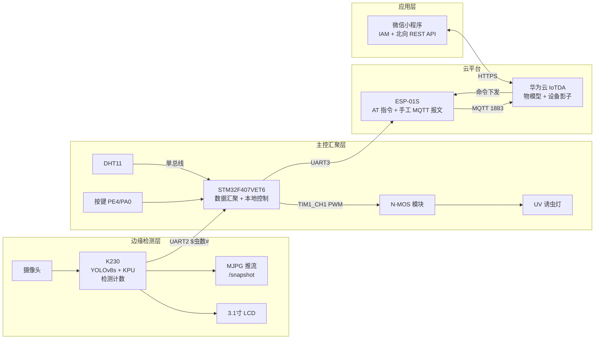

# 基于 K230 与 STM32 的农田虫害智能监测系统

> **端—边—云—应用** 四层物联网系统：K230 边缘 AI 实时识别害虫并计数 → STM32 汇总温湿度与虫情、驱动可调光诱虫灯 → ESP8266 以 MQTT 接入华为云 IoTDA → 微信小程序远程查看数据并调节灯亮度。
> 全链路已实机跑通：设备在线、属性上报、云端命令下发、小程序控制闭环。

---

## 一、系统架构



### 数据流

| 方向 | 链路 | 周期 |
|---|---|---|
| 上行 | K230 `$虫数#` → STM32 → ESP8266 → MQTT `properties/report` → 云端影子 → 小程序查询 | 虫数 1s / 上报 5s |
| 下行 | 小程序 `POST /commands` → 云端 MQTT `sys/commands/#` → STM32 解析 → PWM 调光 → 回执 `result_code:0` | 事件触发 |

---

## 二、功能特性

- **边缘 AI 检测**：自训 YOLOv8s 单类害虫模型，经 nncase 量化成 kmodel，跑在 K230 的 KPU 上；手写无锚框解码 + NMS；断网仍可独立检测计数（边缘自治）
- **多路取图**：一路 RGB565 用于画框/LCD 显示/MJPG 推流，一路平面 RGB888 喂给 NPU；AI2D 硬件做 letterbox 预处理
- **环境监测**：DHT11 单总线温湿度采集（DWT 周期计数器做 µs 级时序）
- **无级调光**：TIM1 高级定时器 1kHz PWM + N-MOS 功率级，0~100% 连续可调（继电器只能开关，故换 MOS）
- **云端接入**：ESP-01S 老 AT 固件无 `AT+MQTT`，因此在 STM32 侧**手写 MQTT 3.1.1 组包**（CONNECT/SUBSCRIBE/PUBLISH/PINGREQ）经 `AT+CIPSEND` 发送
- **双向控制**：小程序通过 IAM 认证调北向 REST API，读**设备影子**（离线也能读最近值）、下发 `set_lamp` 命令
- **本地与远程并存**：按键本地调光与云端下发互不冲突

---

## 三、硬件清单

| 器件 | 型号 | 作用 |
|---|---|---|
| 视觉板 | 亚博 K230 豪华板（CanMV v1.4.3）+ 3.1" ST7701 MIPI 屏 | AI 检测 + 现场显示 |
| 主控 | STM32F407VET6 核心板 | 汇聚 + 控制 |
| WiFi | ESP-01S（AT 固件 1.x） | TCP 透传 + 手工 MQTT |
| 温湿度 | DHT11 | 环境监测 |
| 功率驱动 | N-MOS 调光模块（D4184 类） | 灯珠 PWM 调光 |
| 负载 | UV 紫光诱虫灯珠 | 诱虫 |
| 其他 | CH340K（调试串口）、ST-Link V2、12V 供电 | — |

### 引脚分配

| 功能 | 引脚 | 外设 |
|---|---|---|
| DHT11 数据 | PA1 | GPIO 单总线 |
| K230 串口 | PA3 / PA2 | USART2（115200） |
| 诱虫灯 PWM | PA8 | TIM1_CH1（1kHz） |
| ESP-01S 串口 | PB11 / PB10 | USART3（115200） |
| 调试串口 | PA9 / PA10 | USART1 → CH340 |
| KEY0 开关灯 / WK_UP 亮度档 | PE4 / PA0 | GPIO 输入 |

> K230 侧：`UART2, 115200, TX=IO11, RX=IO12`。接线为 **IO11→PA3、IO12→PA2、两板共地**（不互接 VCC）。

---

## 四、目录结构

```
.
├── 32/                    STM32 主控端（Keil 工程，标准外设库）
│   ├── PestMonitor.uvprojx    Keil 工程文件
│   ├── USER/                  main.c / config.h / stm32f4xx_it.c
│   ├── HARDWARE/              esp8266.c  mqtt.c  k230_uart.c  dht11.c  pwm_lamp.c  delay.c
│   ├── SYSTEM/                标准外设库子集（gpio/rcc/usart/tim/misc）
│   └── CORE/                  CMSIS + 启动文件 + system_stm32f4xx.c
├── 230/                   K230 视觉端（MicroPython / CanMV）
│   ├── main.py                全部业务逻辑（自包含单文件）
│   ├── board_check.py         上板自检脚本
│   ├── ai_dump.py             导出 AI 输入数据 + 文件服务（排查用）
│   ├── get_files.py           板子从 PC 拉文件
│   ├── board_recv.py          PC 向板子推文件
│   └── libs/                  板载 AI 库（AIBase/AI2D/PipeLine）
├── mp/                    微信小程序
│   ├── config.js              云参数默认值
│   ├── utils/huawei.js        IAM token / 设备影子 / 命令下发封装
│   └── pages/                 index（首页）/ setting（设置页）
├── yolo/                  模型训练与转换
│   ├── train.py  export.py  convert_kmodel.py  predict.py
│   └── pest_dataset/data.yaml
├── py/                    早期方案（PC 直连 TCP + Web 视频页，已废弃）
├── TASKS.md               开发任务清单与进度
└── 简历-项目介绍.md        项目亮点描述
```

---

## 五、快速开始

### 1. K230 视觉端

```bash
# SD 卡目录
/sdcard/kmodel/best.kmodel      # 转换产出的模型
/sdcard/libs/                   # AI 库（官方镜像自带）
```
CanMV IDE 打开 `230/main.py` → 点运行（脚本直接传到板子上执行）。
✅ 验收：LCD 出现画面并画出检测框，UART2 每秒发出 `$虫数#`。

### 2. STM32 主控端

本端所有**账号 / 密钥 / 云平台接入信息**都集中在一个私有文件 `32/USER/secret_config.h` 里，它**不进版本库**（已被 `.gitignore` 忽略）。先把模板复制一份：

```bash
copy 32\USER\secret_config.example.h 32\USER\secret_config.h   # Windows
cp   32/USER/secret_config.example.h 32/USER/secret_config.h   # Linux/Mac
```

然后只改这一个文件：

```c
/* 32/USER/secret_config.h —— 唯一需要填私有信息的文件（不进 Git） */
#define WIFI_SSID      "你的WiFi"        /* 必须 2.4G */
#define WIFI_PASS      "你的WiFi密码"

#define IOT_SERVER     "xxx.st1.iotda-device.cn-north-4.myhuaweicloud.com"
#define IOT_DEVICE_ID  "你的设备ID"
#define IOT_CLIENT_ID  "设备ID_0_0_YYYYMMDDHH"   /* 控制台「MQTT连接参数」整对复制 */
#define IOT_PASSWORD   "控制台生成的HMAC密码"
#define IOT_SERVICE_ID "你的服务ID"
```

`32/USER/config.h` 与 `main.c` 通过 `#include "secret_config.h"` 引用它，**源码一行都不用改**。

用 Keil 打开 `32/PestMonitor.uvprojx` 编译下载（AC5 + MicroLIB），或命令行：

```bash
UV4.exe -b 32/PestMonitor.uvprojx -o build.log -j0     # 编译（0 error 0 warning）
UV4.exe -f 32/PestMonitor.uvprojx                      # ST-Link 下载
```
✅ 验收（串口 115200）：
```
=== pest monitor boot (cloud ver) ===
[net] wifi OK → tcp OK → mqtt login OK → subscribe OK (cand 0)
```

### 3. 微信小程序

小程序侧的同类私有信息也在一个单独文件 `mp/config.js` 中，同样不进版本库。先复制模板：

```bash
copy mp\config.example.js mp\config.js      # Windows
cp   mp/config.example.js mp/config.js      # Linux/Mac
```

然后填上自己的华为云参数（或直接在**小程序设置页**里填，本地缓存优先级更高）。之后微信开发者工具导入 `mp/` → 勾选**「不校验合法域名」**→ 编译。
✅ 验收：首页读到影子数据；拖亮度滑条 → 灯实际变化 + 弹提示。

### 4. 模型训练与转换（可选，替换自己的模型）

```bash
python yolo/train.py            # YOLOv8s 训练（单类，imgsz=640）
python yolo/export.py           # 导出 ONNX（opset=12）
pip install nncase==2.11.0
pip install nncase_kpu-2.11.0-py2.py3-none-win_amd64.whl   # 不在 PyPI，需从 Release 下载
python yolo/convert_kmodel.py   # ONNX → kmodel
```

> ⚠️ 量化预处理参数必须是 `input_range=[0,255]`、`mean=0`、**`std=[255,255,255]`**。
> 写成 `std=[1,1,1]` 会让输入被放大 255 倍，表现为分数饱和、满屏乱框。

---

## 六、通信协议

### K230 → STM32（UART2，115200）

```
$<十进制虫数>#        例：$12#  →  本轮检测到 12 只
```

### 华为云 MQTT 主题

| 方向 | 主题 | 载荷 |
|---|---|---|
| 设备→云 | `$oc/devices/{id}/sys/properties/report` | `{"services":[{"service_id":"...","properties":{"temp":25.6,"humi":60,"pests":3,"lamp_on":1,"brightness":50}}]}` |
| 云→设备（订阅） | `$oc/devices/{id}/sys/commands/#` | `{"paras":{"lamp_on":1,"brightness":80},...}` |
| 设备→云（回执） | `$oc/devices/{id}/sys/commands/response/request_id={rid}` | `{"result_code":0}` |

> 云端下发命令后会**等设备回执**，不回执就一直算超时（`IOTDA.014111`）。

### 北向 REST API

| 用途 | 方法与路径 |
|---|---|
| IAM 取 token | `POST https://iam.myhuaweicloud.com/v3/auth/tokens` |
| 查设备影子 | `GET https://{appEndpoint}/v5/iot/{projectId}/devices/{deviceId}/shadow` |
| 下发命令 | `POST https://{appEndpoint}/v5/iot/{projectId}/devices/{deviceId}/commands` |

---

## 七、关键技术点

### 1. 在 MCU 上手写 MQTT 协议栈

手头的 ESP-01S 是 AT 1.x 固件，**没有 `AT+MQTT*` 指令族**，因此 `32/HARDWARE/mqtt.c` 按 MQTT 3.1.1 规范手工组包（含剩余长度变长编码），交给 `AT+CIPSEND=<len>` 发送；接收侧在 USART3 中断里从 `+IPD,<len>:<data>` 中剥离载荷。

### 2. 云端命令丢失的根因排查（最耗时的一个 bug）

**现象**：云侧始终返回 `IOTDA.014111 Command request timed out`，设备串口一个 `+IPD` 都没有；但上行完全正常（影子 `event_time` 持续刷新、设备 ONLINE）。

**定位**：用 PC 直接占用串口抓日志、同时从 PC 发命令，抓到现场 ——

```
[net] RX(len=1): 76     'v'
[net] RX(len=1): 62     'b'
[net] RX(len=1): 6D     'm'
...
HTTP 200: {"error_code":"IOTDA.014111","error_msg":"Command request timed out..."}
```

命令数据**确实到了设备，却被一个字节一个字节地丢掉了**。

**根因**：早期版本把 AT 回显和下行 MQTT 报文塞进同一个缓冲，主循环用"连续两圈内容不变 = 收完了"当判据。但主循环是**微秒级**空转，串口一个字节要 **87µs**，于是缓冲里刚进 1 个字节就被判"收完"并清空，整条 `+IPD` 被逐字节拆碎。

**修复**：
1. USART3 中断内用状态机把 `+IPD` 载荷抽到**独立缓冲**，与主循环节奏彻底解耦
2. 解析判据改为**距最后一个字节空闲 >120ms**
3. 按 MQTT 报文结构（变长剩余长度 → 主题长度 → 载荷）定位字段，而不是字符串搜索
4. 发送侧清掉 AT 回显残留，**只认 `SEND OK`**，消除 `busy s...` 与误判重连

修复后实测：命令 1.01 秒返回 `result_code:0`，影子 `brightness` 同步更新，串口溢出计数 `ore=0`。

### 3. 其他工程细节

- **DHT11 时序**：DWT 周期计数器实现 µs 延时，按高电平宽度区分 bit，校验和容错；读取期间屏蔽中断（约 4ms）
- **中断只做轻活**：串口中断里只收字节/拼帧/置标志，业务判断全部在主循环
- **ESP 半途卡死自愈**：若上次在 `AT+CIPSEND` 中途复位，ESP 会把后续 AT 指令当数据吞掉，`Net_Init` 开头先灌 256 字节填充把它"顶"出数据模式
- **链路自愈**：MQTT 登录/订阅失败自动重连 TCP 重新登录；连续 3 次发送失败触发整链重建

---

## 八、项目亮点

- **边缘 AI 全流程部署**：自采数据集 → YOLOv8s 训练 → ONNX 导出 → nncase 量化 → kmodel 上板，跑在 6TOPS NPU 上
- **云边协同架构**：K230 检测、STM32 汇聚控制、云端物模型、小程序应用，四层职责清晰、双向数据通道可靠
- **物联网物模型实践**：`$oc` 主题的属性上报 / 命令订阅 / 回执闭环；应用侧 IAM token + 设备影子解决设备离线读值问题
- **嵌入式实时性设计**：标准外设库、无 RTOS 的前后台架构，采样/按键/云收发并发不互阻
- **完整的问题定位能力**：分层隔离（上行/设备状态/云投递/设备接收）+ 原始字节级证据，从"云报超时"一路定位到"主循环微秒级误判串口收帧"

---

## 九、注意事项与已知限制

| 项 | 说明 |
|---|---|
| 🔐 **私有配置约定** | 所有 **API Key / 云平台账号 / 服务器账号密码 / Token / 设备密钥**都抽到单独文件，代码只引用它，且该文件通过 `.gitignore` 排除、**绝不入库**；仓库里只留 `*.example.*` 模板。<br>本项目的两个私有文件：`32/USER/secret_config.h`（WiFi + 华为云三元组）、`mp/config.js`（IAM 账号 + IoTDA 接入信息） |
| DHT11 | 手头模块故障（`err=3`），换新即可，驱动无需改 |
| 命令解析 | 目前用 `strstr` 简化实现，字段一多建议换轻量 cJSON |
| 上报方式 | MQTT 发送为阻塞式（约 0.5s/次），可改环形缓冲异步化 |
| 无 OTA / 断线补传 | 断线只重连，不缓存历史数据 |

> [!IMPORTANT]
> 若你曾经把真实凭据提交过，**删除文件不等于清除历史**。正确做法是：① 立即到云平台**轮换/重置**该密钥；② 再把凭据抽成 `*.example.*` 模板并加入 `.gitignore`。本项目即按此流程整理。

---

## 十、开发文档

本项目的完整开发文档（架构、硬件接线、各端实现、部署流程、故障排查、扩展指南）已整理为 Obsidian 知识库，共 11 篇笔记；`TASKS.md` 记录了开发进度与踩坑清单。

## License

仅供学习与交流使用。
